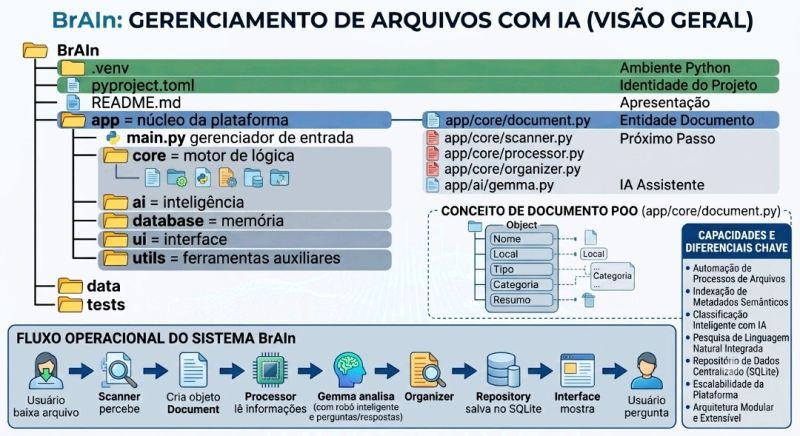

# BrAIn 🧠
**Local AI Document Assistant**

O BrAIn é um assistente inteligente projetado para a organização, gerenciamento e localização de documentos utilizando Inteligência Artificial executada 100% localmente.

A proposta é oferecer uma solução definitiva para ajudar usuários e empresas a encontrarem documentos perdidos ou desorganizados em suas próprias máquinas, garantindo total privacidade, segurança e controle dos dados (alinhado às boas práticas de governança e LGPD).

---

## O Problema
Diariamente, milhares de arquivos são criados, baixados e compartilhados:

* 📄 PDFs e Documentos de texto
* 📊 Planilhas e Apresentações
* 📘 Manuais e Procedimentos operacionais
* 📑 Atas e Relatórios

Com a correria do dia a dia, a grande maioria acaba se perdendo num "buraco negro" chamado pasta Downloads ou em diretórios sem a devida organização. Muitas vezes, você lembra perfeitamente do contexto e do conteúdo do arquivo, mas o nome ou o local exato viram um mistério.

> *"Preciso encontrar aquele PDF com o procedimento de instalação que baixei há alguns meses... Cadê?"*

O BrAIn resolve esse problema combinando indexação inteligente de metadados e o poder da IA local.

---

## Objetivo do MVP
Criar um assistente local leve e eficiente, capaz de:

* 🔍 Monitorar e identificar novos arquivos no computador.
* 🗂️ Organizar informações estruturadas e extrair contexto.
* 💾 Armazenar metadados de forma segura e local.
* 🧠 Permitir buscas inteligentes baseadas em linguagem natural.
* 🖥️ Auxiliar o usuário através de uma interface intuitiva.

---

## Arquitetura do Sistema

---

## Stack Tecnológico

**Backend & Estrutura**
* **Linguagem:** Python
* **Paradigma:** Programação Orientada a Objetos (POO) e Clean Code
* **Ambiente & Gestão:** uv, Git, GitHub

**Inteligência Artificial**
* **Modelo:** Gemma (Google)
* **Engine:** Ollama (Processamento 100% local)

**Banco de Dados & Interface**
* **Memória Central:** SQLite
* **Frontend:** Python Desktop GUI

---

## Princípios de Engenharia de Software
O desenvolvimento deste projeto é guiado pelas melhores práticas de engenharia:

* **Código Limpo (Clean Code):** Nomes de variáveis descritivos e funções objetivas.
* **Arquitetura Modular:** Separação clara de responsabilidades.
* **Baixo Acoplamento:** Módulos independentes e facilmente testáveis.
* **Privacidade by Design:** Nenhum dado sensível sai da máquina do usuário.

---

## Roadmap

**Fase 1 - Fundação e Estrutura**
- [x] Configuração inicial do projeto
- [x] Criação do ambiente isolado Python com uv
- [x] Estruturação modular de diretórios

**Fase 2 - Núcleo do Sistema (Core)**
- [x] Definição da entidade Document
- [ ] Desenvolvimento do Scanner de arquivos
- [ ] Configuração e persistência no banco SQLite
- [ ] Indexação e cadastro de metadados

**Fase 3 - Inteligência Artificial**
- [ ] Integração do Ollama/Gemma com o sistema
- [ ] Categorização automática de arquivos
- [ ] Geração de resumos (Summarization)
- [ ] Motor de busca inteligente

**Fase 4 - Interface do Usuário (UI)**
- [ ] Criação do Dashboard Desktop
- [ ] Visualização de lista de documentos
- [ ] Barra de pesquisa inteligente
- [ ] Chat integrado com o assistente

**Fase 5 - Next Level (Integração RAG) 🔮** 
- [ ] Implementação de RAG (Retrieval-Augmented Generation)
- [ ] Processamento de conteúdo interno dos documentos (Embeddings)
- [ ] Criação de base de dados vetorial local (Vector DB)
- [ ] Chat interativo diretamente com o conteúdo da base de conhecimento ("Converse com seus arquivos")

---

## Segurança e Privacidade
O BrAIn nasceu com o princípio fundamental do processamento estritamente local.
Isso significa que seus manuais, contratos, planilhas e relatórios permanecem 100% no seu ambiente. A aplicação evita o envio de qualquer informação sensível para APIs externas ou serviços em nuvem, garantindo governança total dos seus dados.

---

## 🚧 Status do Projeto
**Em desenvolvimento ativo.**
Este MVP está sendo construído com foco em aprimoramento técnico, aplicação de boas práticas de arquitetura de software e exploração prática de Inteligência Artificial generativa local.

---

** Autor**

**Sandro Monteiro**
*Desenvolvedor RPA*